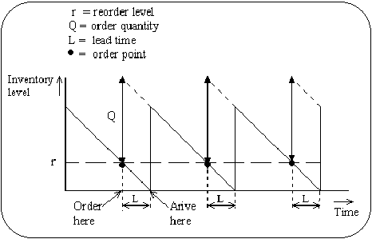
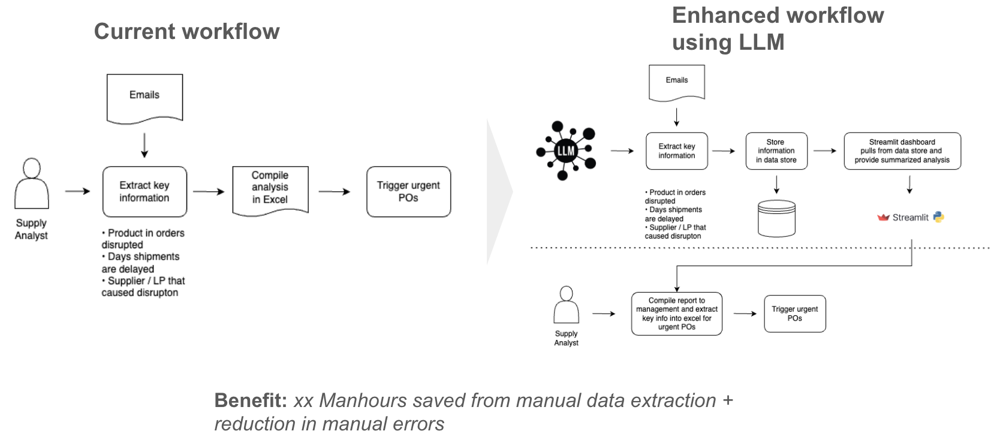
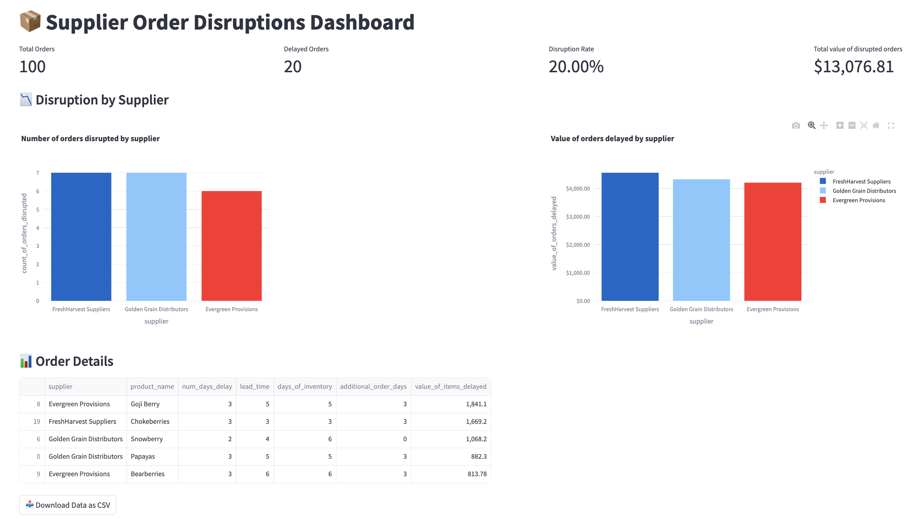

# Orders Disruption Dashboard, powered by LLMs

## Business Problem Description
Nature’s Basket Shopper's Paradise Mart (NBSPM) is a fictitious premium grocery shop, providing unique offerings to health-conscious consumers. NBSPM employs a continuous ordering inventory policy to manage inventory, ensuring that stock of items are replenished in a timely manner. This means that when stock reaches below the reordering point, NBSPM will need to trigger a purchase order to suppliers. The diagram belows gives an illustration of how the continous ordering policy works

 </br>
*Image from: https://www.researchgate.net/figure/Continuous-review-model-of-inventory_fig1_257029221*

As a result, a supply planning analyst has to monitor inventory levels and ongoing shipments daily. If there is a delay in shipment of items, items might need to be procured through urgent orders to prevent out-of-stock. However, this is tedious and time consuming as the analyst has to comb through emails and extract key information from emails about shipment disruptions daily. Through the use of Large Language Model (LLM), the process can be automated by having the LLM extract key information such as shipment quantity delayed, product and supplier in an automated fashion, saving time and effort and reducing errors from manual labour. The diagram below summarizes the enhanced workflow using a LLM:




## Technical Solution Description
### How does each script work?
1. gen_synthetic_product_data generates 100 records of synthetic product data using a LLM
2. gen_synthetic_emails generates 20 emails of items shipments being delayed
3. reorder_calculations calculates the amount of items to reorder and reorder date, assuming the inventory policy is continous

streamlit_dashboard.py generates a dashboard showing a summary of products with orders disrupted, and their value by supplier.

### How to run each script?
- First run ```pip install -r requirements.txt```
- Next, ensure that you create a .env file and define 2 config variables in it:
```bash
OPENAI_API_BASE
OPENAI_API_KEY
```
- To view the dashboard, run ```streamlit run streamlit_dashboard.py```

### Dashboard Preview


## Practical Considerations / Potential Improvements
- *Data format* - In this project, we assumed that emails were used to report orders disruption. What if suppliers and the retailer are using Electronic Data Interchange (EDI) for exchanging information? We might need to employ a Vision Language Model (VLM) instead to parse data from the semi-structured order status / order delay reports
- *Data Post-processing* - Synthetic emails from a LLM were used as sample data for parsing. The data extraction results were accurate but that could be due to the LLM parsing data in-distribution. By using real world data, we can have a better idea on some of the issues that can occur when using LLMs to parse data and enhance the data post-processing logic
- *Hallucinations* - LLMs are known to hallucinate, this means every now and then, the model can hallucinate products that are non-existent or quantities not stated in the email. We can add safeguards to detect this and fallback to human-in-the-loop if needed. One potential safeguard we can introduce is an ensemble of LLMs (if one LLM has a different output from another, flag out the email for the analyst to handle manually)
- *Data Privacy* - Here we used the ChatOpenAPI API from Langchain to pass data to a open-source LLM. If data privacy is critical, a LLM will have to be hosted on an on-prem server to prevent data from leaking to competitors
- *Scalability / Practical Considerations* - Realistically, data pipelines need to be built to pipe data, from emails to a text database, and to pipe outputs to a relational database. A cloud/on-prem database can be used to host key datasets. The pipelines should run on a scheduled basis, using a scheduler such as Airflow, from data pipelines to dashboard refresh. To save costs, benchmark studies should be done between different LLM models, to select the model with the best tradeoff between cost and performance. Caching is also essential to reduce cost of API calls / database queries.