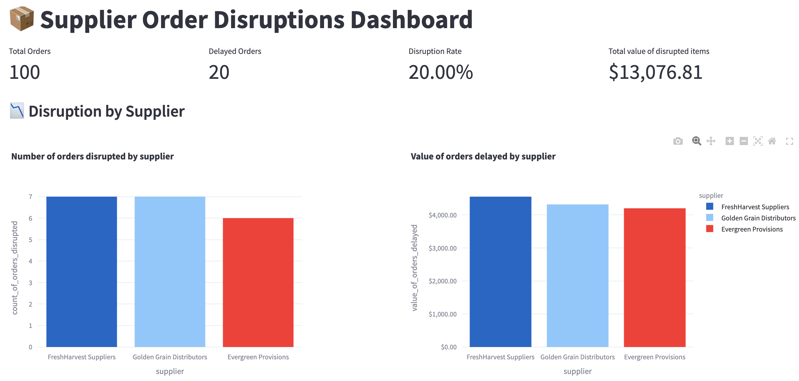
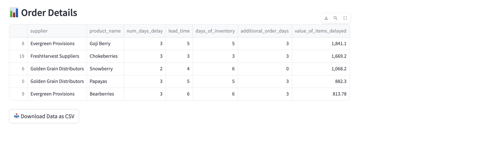

# Orders Disruption Dashboard, powered by LLMs


## How does each script work?
1. gen_synthetic_product_data generates 100 records of synthetic product data using a LLM
2. gen_synthetic_emails generates 20 emails of items shipments being delayed
3. reorder_calculations calculates the amount of items to reorder and reorder date, assuming the inventory policy is continous

streamlit_dashboard.py generates a dashboard showing a summary of products with orders disrupted, and their value by supplier.

## How to run each script?
- First run ```pip install -r requirements.txt```
- Next, ensure that you create a .env file and define 2 config variables in it:
    1. OPENAI_API_BASE
    2. OPENAI_API_KEY


